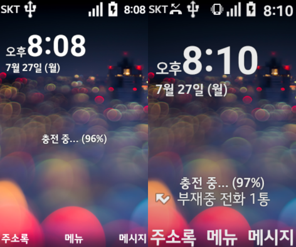
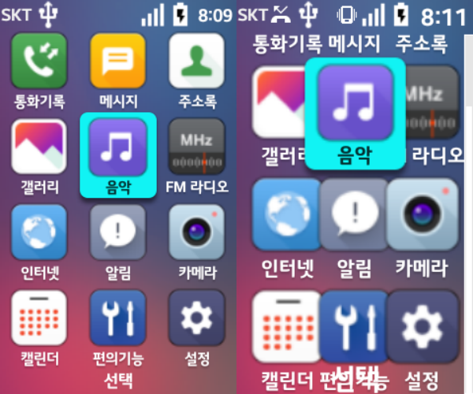
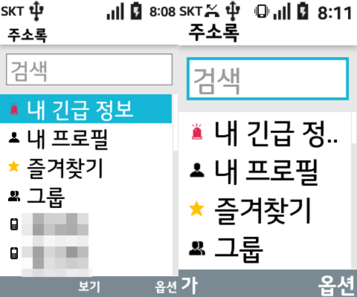
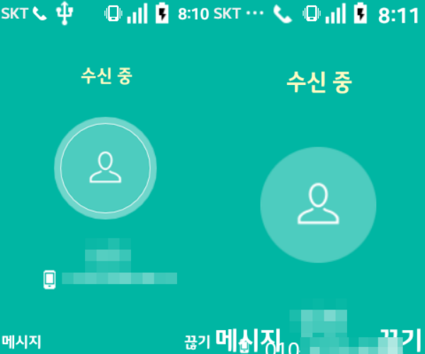
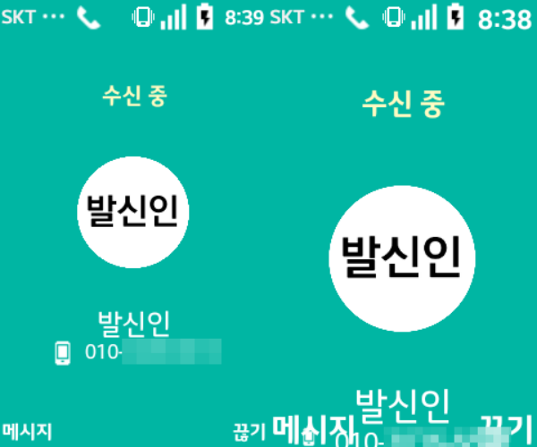

## LG Folder 화면 글자를 더 크게 확대하기

### 문제

SKT 2G서비스 종료로 효도폰이 필요하게 되어 LG Folder로 보상기변을 받게 되었다.
LG Folder 2가 새로 나왔지만, 해상도를 비롯해서 여러모로 원가절감이 들어간 느낌이 들어 일부러 1버전으로 선택했다.

> 해상도
>
> - LG Folder 1: 240x400 (3" WVGA)
> - LG Folder 2: 240x320 (2.8" VGA)

다시 확인해보니, 세로가 짧아진 대신 가로로 살짝 늘어난 것으로 보여 어느것을 선택해도 크게 문제가 없었을 것 같다.

> 참고: UnderKG 리뷰 https://youtu.be/dZsHYG-Fh98?t=190

그런데, 글자 크기를 최대로 하더라도 너무 작아서 읽기 어렵다는 피드백을 받아서, Android의 density를 조절해보기로 했다.

### 방법

- LG United Mobile Driver ([링크](https://www.lge.co.kr/lgekor/download-center/downloadCenterList.do))
- adb

LG 폴더 커스터마이징 관련 개인 블로그([링크](https://yvelta1.github.io/pages/init/))에서 USB 디버깅 활성화에 대해 잘 정리가 되어 있어서 참고했다.

#### Density 변경 방법

```
(현재 Density 확인)
$ adb shell wm density

Physical density: 160


(DPI를 200으로 변경)
$ adb shell wm density 200
(확인)
$ adb shell wm density
Physical density: 160
Physical density: 200
```

### 결과

- 전화 수신시 전화번호가 모두 표시되지 않아서, 최종적으로는 `200`으로 변경했다.
- 왼쪽 화면이 기본 DPI(`160`) | 오른쪽은 `210`으로 조정

#### 홈스크린


시계 크기가 커졌지만, "부재중 전화"와 읽지 않은 메시지가 오면 충전중 글자와 겹친다.

#### 메뉴



#### 주소록



#### 전화 수신



- DPI `210`에서는 전화번호가 제대로 보이지 않아, `200`이 최대인것 같다.



- 글자를 키우는데 한계가 있어, 글자로 만든 사진파일을 만들어 주소록 사진으로 설정했다. -\_-v
