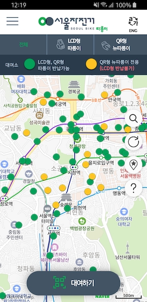

## 따릉이

> 따릉이? 서울시에서 운영하는 무인 자전거 대여 시스템

### 종류
> LCD형과 QR형(신형)이 있음
- LCD형
  - 자전거에 **LCD**가 달려있음
  - 앱이 필요하지 않음
  - 자전거를 잠글 때 선을 뽑아서 연결해야 함
  - QR형 스테이션에서는 **반납불가**
- QR형
  - 스마트폰으로 자전거 QR코드를 찍어서 대여하는 방식
  - 대여시 앱이 필요함 (QR코드를 찍어야해서)
  - 자전거를 잠글 떄 뒷바퀴의 레버를 누르면 됨 (원터치라 편함)
  - QR형/기존 LCD형 스테이션에서 모두 반납 가능

### 앱 화면

### 사용후기
- 기존 따릉이도 사용에 크게 불편한 점은 없었는데, QR형 따릉이는 짱편하다.
- 제로페이로 결제하면 **50%** 할인이라 무조건 제로페이 쓰게됨 (정기권은 30%) 
- 이전에는 웹페이지 북마크해서 사용했는데, 신형을 빌리려면 앱이 필요함
- 기억이 잘 안나는데 지도 공급자가 Naver로 바뀐듯?

### 참고
- [서울자전거 따릉이](https://www.bikeseoul.com/main.do)